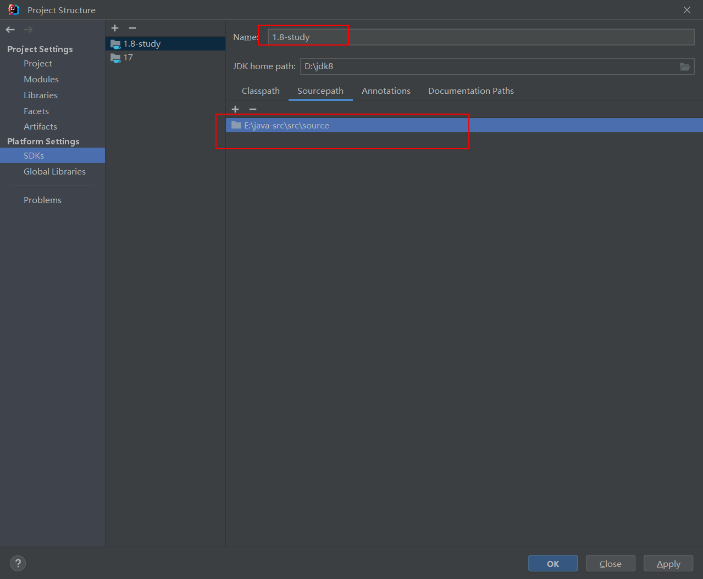
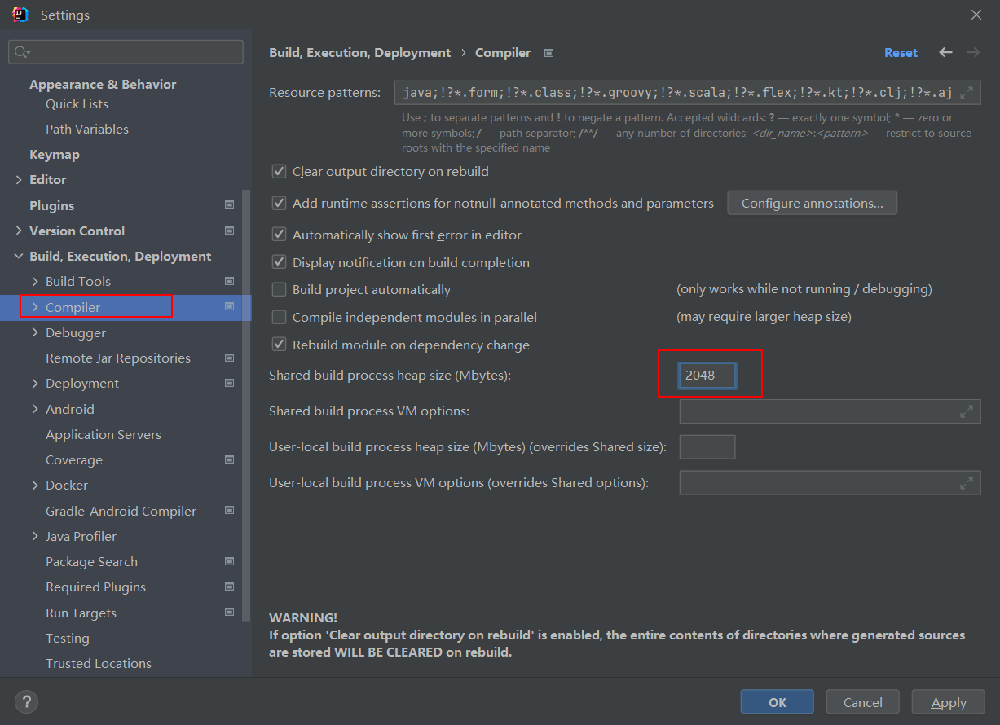
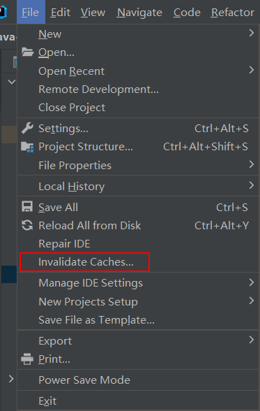
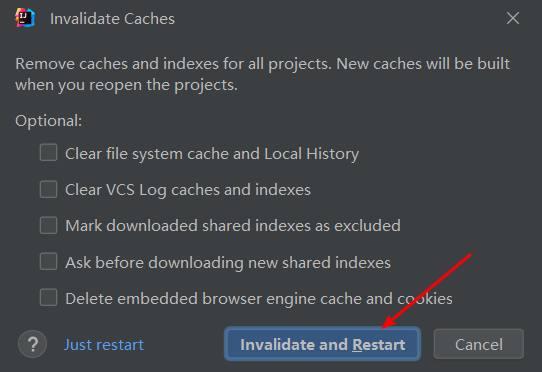
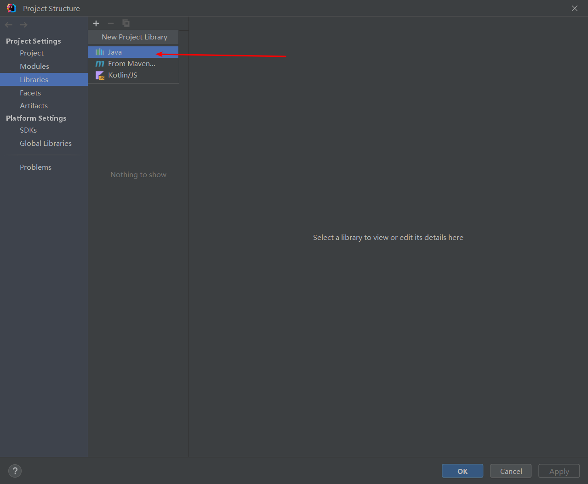
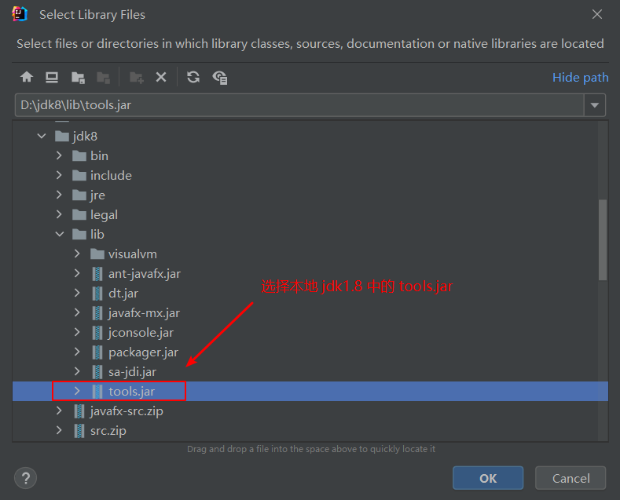
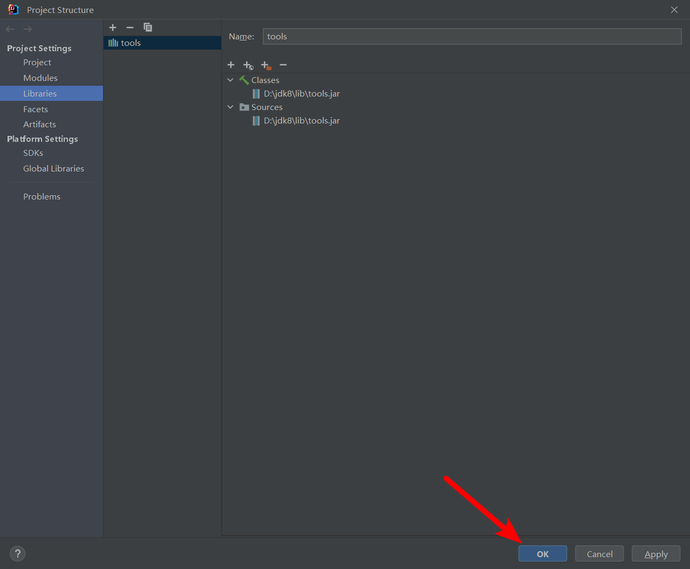
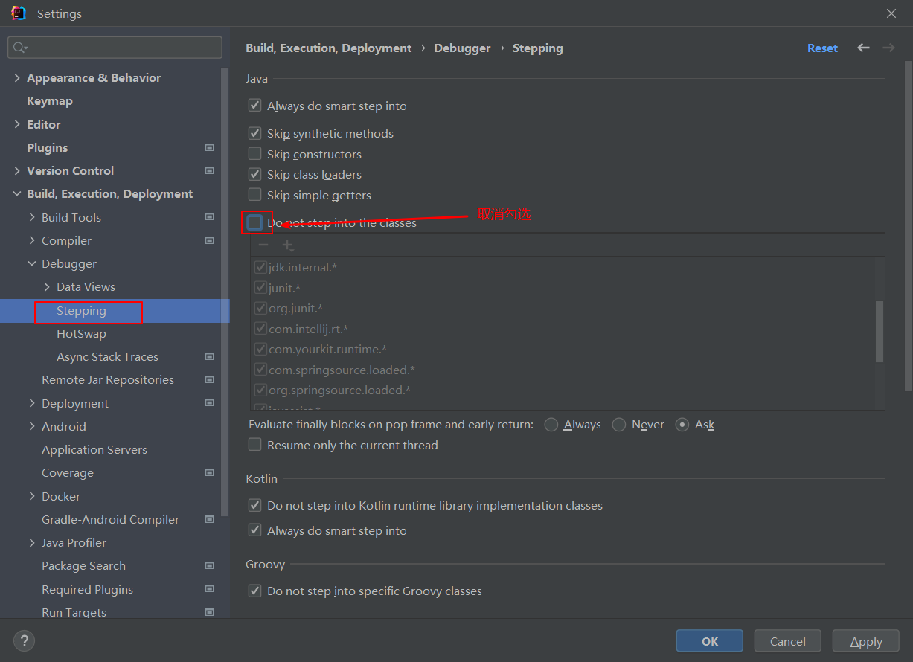
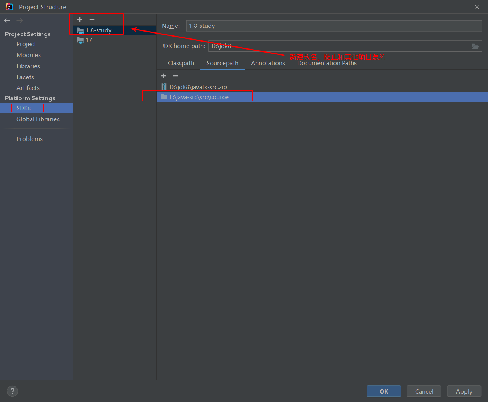

# 搭建源码阅读工程
##### 1. 创建空项目（默认选择 jdk 1.8 版本），创建 source 和 test 两个目录


##### 2. 自定义并修改 jdk 的位置，将源码中的 src.zip 解压到自己 source 包中，并新建一个sdk，以免与其他项目发生干扰



##### 3. 修改系统资源，防止系统资源不足 (OutOfMemoryError)



> 这里根据自己电脑资源设置。

##### 4. 调试并运行

我们可以在 test 目录里去随意编写一段测试代码。比如我这里就以 `HashMap` 为例，在 test 目录下创建一个测试主入口文件 `Test.java` ，随意放上一段测试代码：

```java
package cn.ice.test;

import java.util.HashMap;
import java.util.Map;

public class Test {
    public static void main(String[] args) {
        Map<String, Double> hashMap = new HashMap<>();

        hashMap.put("k1", 0.1);
        hashMap.put("k2", 0.2);
        hashMap.put("k3", 0.3);
        hashMap.put("k4", 0.4);

        for (Map.Entry<String, Double> entry : hashMap.entrySet()) {
            System.out.println(entry.getKey() + "：" + entry.getValue());
        }
    }
}
```

然后随意打个断点，debug 测试运行。

##### 5. 问题解决

- 找不到 sun.awt.UNIXToolkit 

  在 source 下新建包 sun.awt 并添加 java 文件 UNIXToolkit.java，UNIXToolkit 代码如下：

  ```
  http://hg.openjdk.java.net/jdk8u/jdk8u/jdk/file/e17fe591a374/src/solaris/classes/sun/awt/UNIXToolkit.java
  ```

  > 注：代码报错先不管。

  下面刷新 IDEA 缓存：

  

  

- 找不到 sun.font.FontConfigManager

  在 source 下新建包 sun.font 并添加 java 文件 FontConfigManager.java，FontConfigManager 代码如下：

  ```
  http://hg.openjdk.java.net/jdk8u/jdk8u/jdk/file/e17fe591a374/src/solaris/classes/sun/font/FontConfigManager.java
  ```

  > 注：代码报错先不管。

  继续刷新 IDEA 缓存。

- 程序包 com.sun.tools.javac.api 不存在

  

  

  

##### 6. 完善项目设置

- **允许调试进入**

  此时如果我们打断点进行单步调试的话，可以发现点击 **Step Into** 无法进入源码内部，因为 JDK 源码的受保护的，无法进入，但是点击 **Force Step Into** 是可以进入源码内部的。如果想要直接按 <kbd>F7</kbd> (即点击 **Step Into** )进入源码内部的话，需要做如下设置：

  

- **编辑源码文件**

  如果我们想要对源码文件做记录或者注释时，会发现源码文件是只读的，无法编辑。因为此时项目关联的源码文件还不是刚才复制进项目的文件，而是 jdk 安装目录下的源码文件。重新将项目关联的源码文件设置成该项目下的源码文件即可。

  

  
